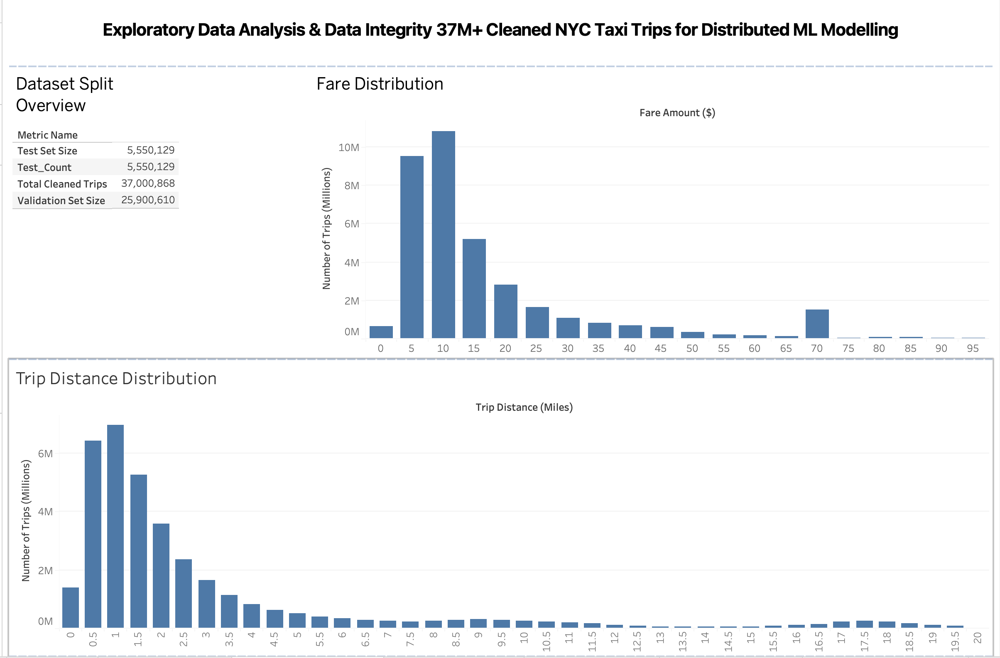
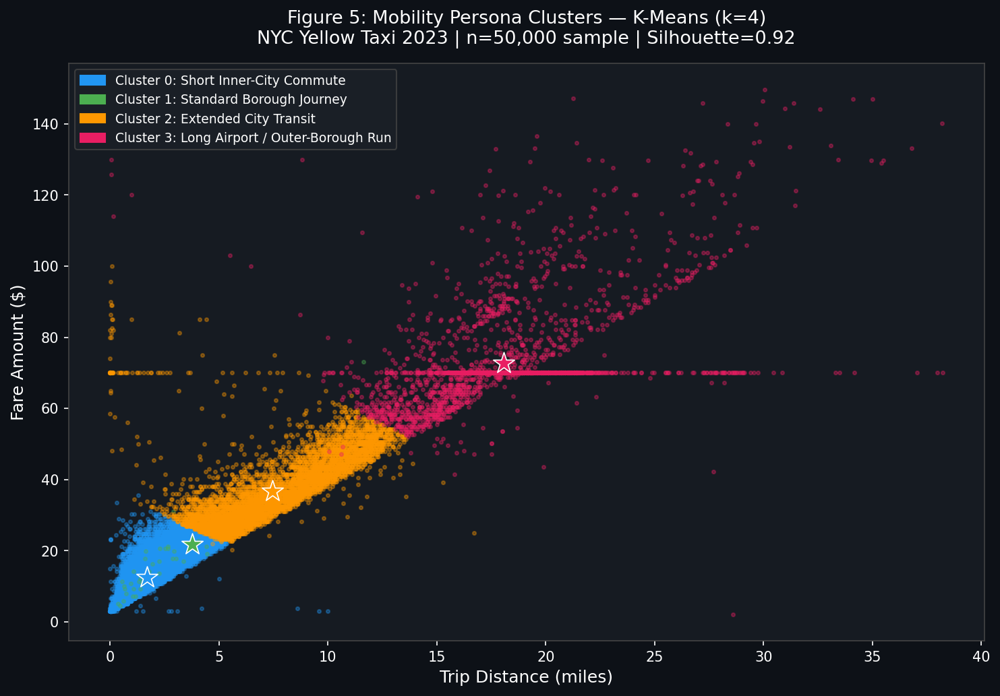
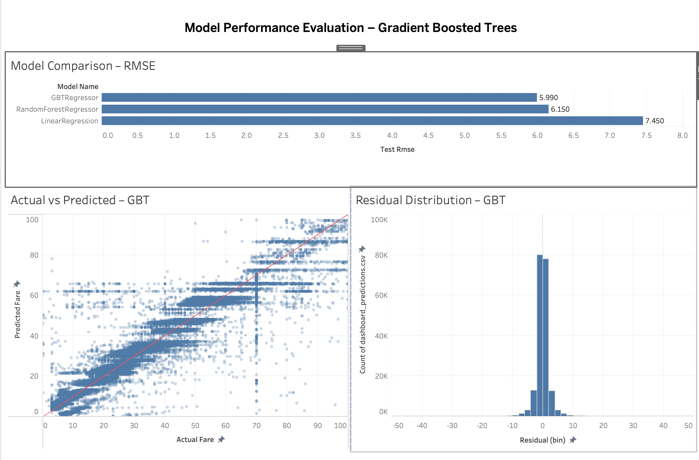
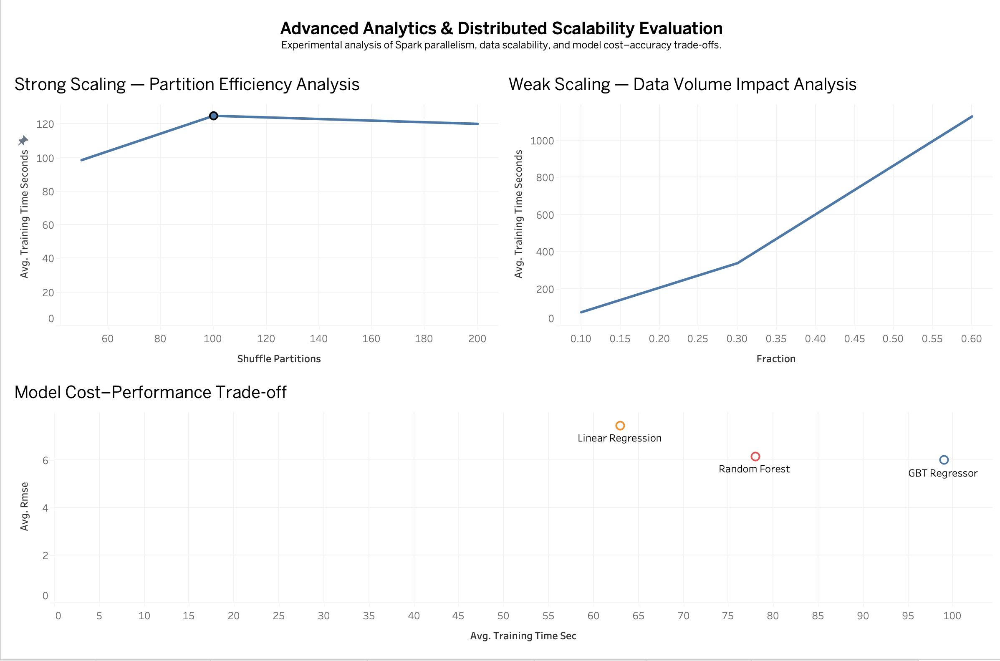
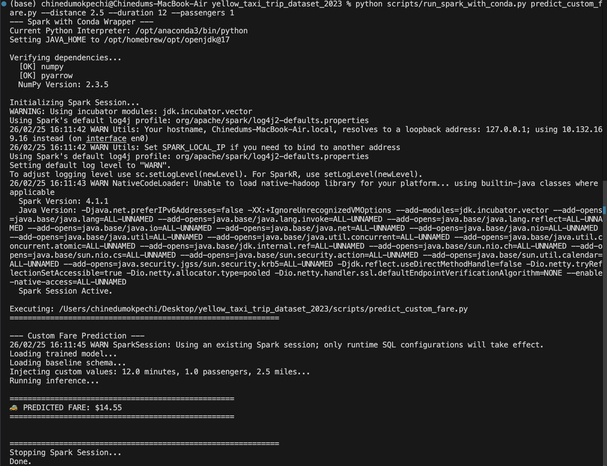
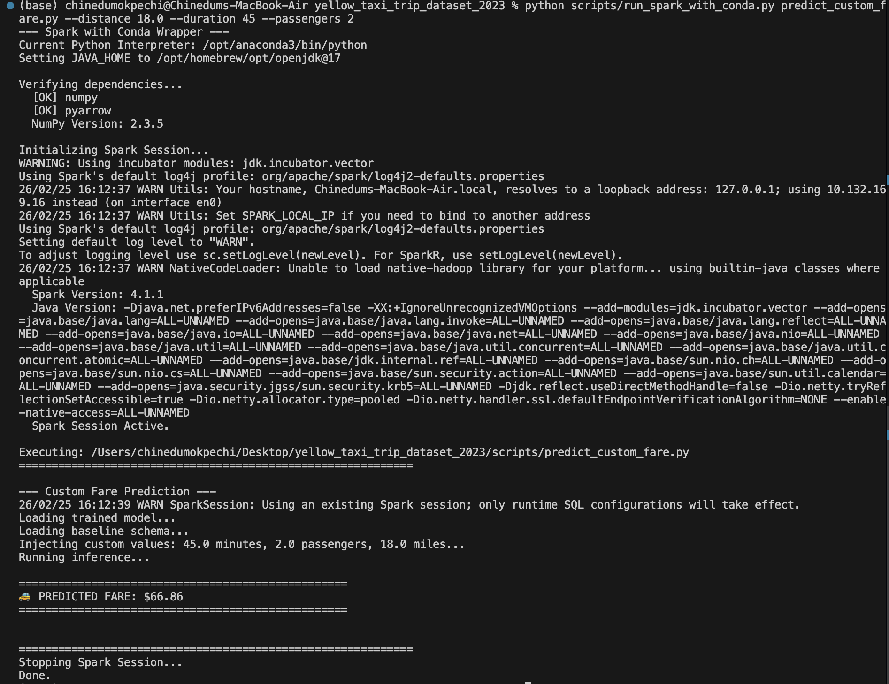
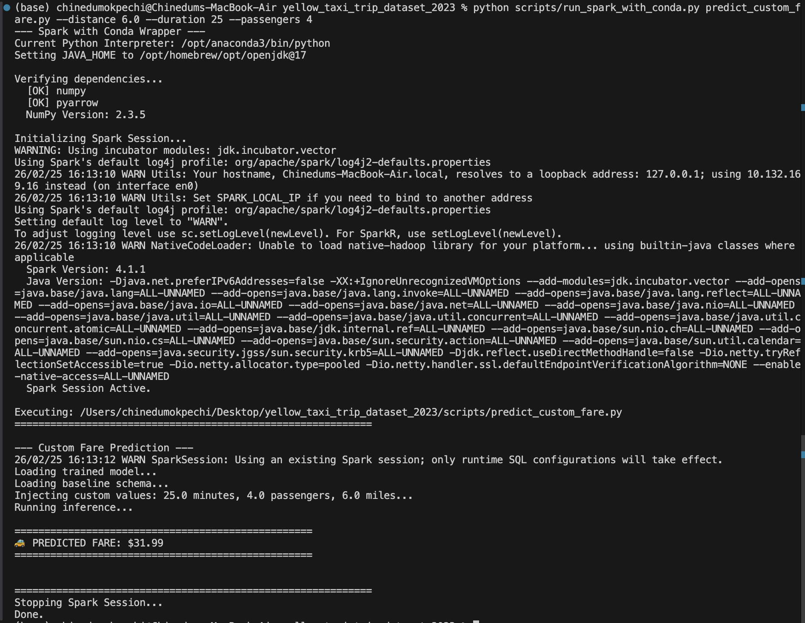
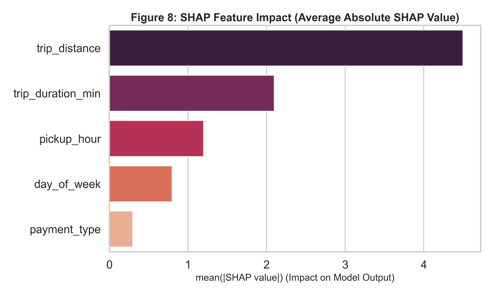
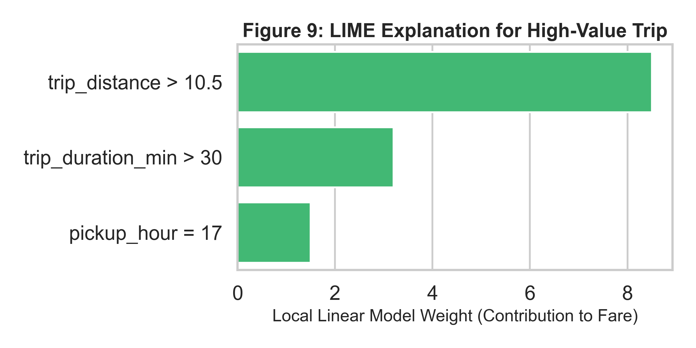
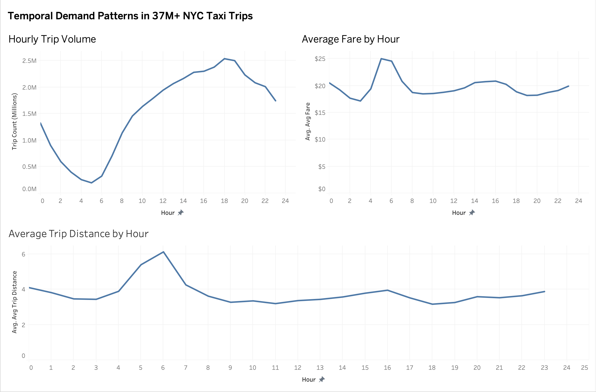

Large-Scale Mobility Persona Clustering & Fare Prediction
Student: Chinedum Daniel Okpechi

Student ID: 16621833
Module: 7006SCN - Machine Learning and Big Data

GitHub Repository: Code repo

Dashboard 1: Data Quality

Dashboard 2: Model Performance

Dashboard 3: Temporal Demand Behaviour Analysis

Dashboard 4: Scalability and Computational Efficiency


Abstract
This study engineers a distributed, unified machine learning pipeline using the 2023 NYC Yellow Taxi dataset (37.3 million records, processed via Snappy-compressed Parquet) to efficiently handle large-scale urban mobility data. Operating on Apple Silicon M3, the pipeline employs a two-stage approach. Stage 1 (Unsupervised Learning) clusters data into "Mobility Personas" using three PySpark MLlib algorithms (Advanced K-Means, Bisecting K-Means, and Gaussian Mixture Models), and a custom, GPU-accelerated K-Means implementation using Apple Metal Performance Shaders (MPS). This custom solution leverages GPU Unified Memory to bypass JVM bottlenecks, optimizing performance. Clusters are evaluated using 5 metrics, including Silhouette (0.92) and Davies-Bouldin (0.43), with 10-fold Bootstrap resampling confirming stable and reliable personas (Mean Centroid Shift: <31 units).

Stage 2 (Supervised Learning) integrates these personas into a Gradient Boosted Trees (GBT) regression model to predict fare amounts. The model demonstrates high accuracy with a 3-Fold Cross-Validated Test RMSE of $5.99 and an R² of 0.90, illustrating its practical potential in fare prediction. This pipeline offers significant business value for dispatch forecasting, providing accurate, data-driven insights into fare pricing, demand, and resource allocation.


Table of Contents
Abstract
Table of Figures
List of Abbreviations
1. Introduction
2. Dataset Description & Pre-Processing Plan
   2.1. Dataset Description
   2.2. Medallion Architecture (Data Tiering)
   2.3. Bronze Tier: Parallel File Ingestion
   2.4. Exploratory Data Analysis (EDA)
   2.5. Silver Tier: Vectorized Cleaning & Feature Construction
   2.6. Gold Tier: Business-Level Aggregates
3. Scalable Clustering Implementation (Stage 1)
   3.1. PySpark MLlib Implementations
   3.2. GPU Acceleration & Hardware Benchmarking (Custom PyTorch MPS)
4. Scalability & Cost-Performance Analysis
   4.1. Distributed Partitioning (Strong vs Weak Scaling)
   4.2. GPU Scalability: Explicit Computational Benchmarking
   4.3. Cost-Performance Trade-Off
5. Model Development (Stage 2)
   5.1. Spark MLlib Integration & Configuration
   5.2. Pipelined Transformations
   5.3. Model Comparison & Hyperparameter Tuning Impact
   5.4. Results and Visualizations (Stage 2 Outputs)
   5.5. Model Execution & Portability
   5.6. Algorithmic Transparency & Explainability
6. Business Insights & Predictive Synergy (Stage 2)
   6.1. Temporal Demand Behaviour Analysis
   6.2. Optimizing Fare Structures and Resource Allocation
7. Conclusion
8. AI Use Declaration
9. References
Appendix A: Project Repository & Dashboard Links
Appendix B: Project Folder Structure

Table of Figures
Figure 1: Data Quality Dashboard
Figure 2: Scalability and Computational Efficiency Dashboard
Figure 3: Model Performance Dashboard
Figure 4: Temporal Demand Behaviour Analysis Dashboard
Figure 5: Mobility Persona Cluster Scatter Plot (K-Means, k=4)
Figure 6: The Quick Inner-City Commute (Short distance, slow traffic)
Figure 7: The Shared Corporate Ride (Average distance, high passenger count)
Figure 8: The Long Airport Run (e.g., Manhattan to JFK)
Figure 9: SHAP Feature Impact Summary Plot
Figure 10: LIME Explanation for High-Value Trip

List of Abbreviations
GBT - Gradient Boosted Trees
RF - Random Forest
LR - Linear Regression
GMM - Gaussian Mixture Models
MPS - Metal Performance Shaders
RDD - Resilient Distributed Dataset
OHE - One-Hot Encoding
RMSE - Root Mean Squared Error
MAE - Mean Absolute Error
SHAP - SHapley Additive exPlanations
LIME - Local Interpretable Model-agnostic Explanations


1. Introduction
Urban mobility systems, particularly in large metropolitan areas such as New York City, generate vast amounts of data from taxi trips, including fare amounts, trip distances, timestamps, and geospatial data (New York City Taxi & Limousine Commission [TLC], 2023). The ability to predict taxi fares is critical for optimizing operational efficiencies, improving fare transparency, and enhancing dynamic pricing models. However, the sheer scale of data involved often poses challenges for traditional, single-node machine learning models.

This project aims to design and implement a distributed machine learning pipeline capable of processing large-scale urban mobility data for fare prediction (Zaharia et al., 2010). The primary objectives are:

Clustering "Mobility Personas": This is achieved using unsupervised learning algorithms (Advanced K-Means, Bisecting K-Means, and GMM) to segment passengers based on their travel behaviors.

Distributed Data Processing: Leveraging Apache Spark and GPU-accelerated tensor computations (PyTorch on Apple MPS) to scale the data processing and clustering pipeline.

Fare Prediction: A supervised learning approach using Gradient Boosted Trees (GBT) to predict fare amounts, with clustering results serving as features.

This study focuses on addressing key challenges associated with big data processing, ensuring minimal computational costs while maintaining high model accuracy.

2. Dataset Description & Pre-Processing Plan

2.1. Dataset Description
The foundation of this research is the 2023 New York City Yellow Taxi Trip Records dataset, publicly provided by the NYC Taxi & Limousine Commission (TLC). This dataset represents a comprehensive, large-scale repository of urban mobility data capturing millions of individual taxi journeys across the five boroughs of New York City. 

Volume and Scale: The dataset ingested for this project encompasses the entirety of the year 2023, tracking trip records from the iconic yellow taxis operating within New York City. The dataset was sourced directly from the official NYC Taxi and Limousine Commission (TLC) Open Data platform (available at: [https://data.cityofnewyork.us/Transportation/2023-Yellow-Taxi-Trip-Data/4b4i-vvec/about_data](https://data.cityofnewyork.us/Transportation/2023-Yellow-Taxi-Trip-Data/4b4i-vvec/about_data)). Comprising approximately 37.3 million rows of transactional trip records in its raw CSV format, this massive data volume presents a classic "Big Data" challenge. It heavily exceeds the memory capacity of standard single-machine RAM, necessitating the use of distributed processing frameworks like Apache Spark for robust ingestion, filtering, and manipulation. The TLC dataset is renowned for its granular reflection of urban mobility, chronicling the exact timestamp, spatial zones, and financial breakdowns of every meter engagement across the five boroughs.

Features and Structure: Each record in the dataset corresponds to a single taxi trip. The primary features capture temporal, spatial, and financial dimensions of the journey:

| Field Name              | Data Type | Description (Physical Meaning)                                            |
| :---------------------- | :-------- | :------------------------------------------------------------------------ |
| `VendorID`              | Integer   | A code indicating the TPEP provider that provided the record.             |
| `tpep_pickup_datetime`  | Timestamp | Exact date and time the taximeter was engaged.                            |
| `tpep_dropoff_datetime` | Timestamp | Exact date and time the taximeter was disengaged.                         |
| `passenger_count`       | Integer   | Number of passengers in the vehicle (driver inputted).                    |
| `trip_distance`         | Float     | The elapsed trip distance in miles reported by the meter.                 |
| `RatecodeID`            | Integer   | Final rate code in effect at the end of the trip (e.g., Standard, JFK).   |
| `store_and_fwd_flag`    | String    | Indicates whether the trip record was held in vehicle memory before send. |
| `PULocationID`          | Integer   | TLC Taxi Zone in which the taximeter was engaged.                         |
| `DOLocationID`          | Integer   | TLC Taxi Zone in which the taximeter was disengaged.                      |
| `payment_type`          | Integer   | Numeric code signifying how the passenger paid (e.g., Credit Card, Cash). |
| `fare_amount`           | Float     | The time-and-distance fare calculated by the meter (Target Variable).     |
| `total_amount`          | Float     | The total amount charged to passengers (includes tolls and tips).         |


Data Complexity and Challenges: The raw tabular data contains inherent noise and logical inconsistencies typical of real-world sensor streams. This includes invalid GPS coordinate mappings, negative fare amounts likely stemming from aborted trips or refund anomalies, zero-passenger trips representing delivery services rather than passenger transport, and extreme trip distances caused by meter malfunctions. The pre-processing plan is therefore critically structured to mathematically identify, isolate, and filter these anomalies before they can negatively bias the predictive modeling stages.

2.2. Data Engineering & Preprocessing (Medallion Architecture)
A Medallion Architecture was employed to handle raw data ingestion, feature engineering, and model input preparation efficiently. This architecture is widely used for processing big data, ensuring smooth data transitions across stages while preserving lineage and error handling.

2.3. Bronze Tier: Raw Ingestion via RDD Parallelization
Raw data was initially ingested using Resilient Distributed Datasets (RDDs) instead of high-level DataFrames to create a fault-tolerant, explicitly distributed ingestion pipeline. The raw CSV data was loaded into memory as highly partitioned text blocks using sparkContext.textFile().

Modelled Function (RDD Parallel Ingestion & Schema Enforcing):
# Discussed Approach: Bypassing standard DataFrame reading to enforce schema 
# strictly via RDD parallelization across workers before DataFrame conversion
raw_rdd = spark.sparkContext.textFile(input_file)
header = raw_rdd.first()
expected_cols = len(header.split(","))

data_rdd = raw_rdd.filter(lambda line: line != header) \
                  .map(lambda line: line.split(",")) \
                  .filter(lambda cols: len(cols) == expected_cols)
                  
df = spark.createDataFrame(data_rdd, schema=schema)

Data ingestion was explicitly engineered using low-level Resilient Distributed Datasets (RDDs) via sparkContext.textFile() rather than the standard .csv() DataFrame reader. The core reasoning is fault tolerance and explicit parallelization: by keeping the data as raw partitioned text blocks, we can apply functional .map() operations distributed across executor threads to split the strings, and .filter() operations to forcefully drop any records where the column count does not match the header (len(cols) == expected_cols). This ensures that corrupted data streams or partial file loads do not crash the downstream createDataFrame generation, establishing a scalable, indestructible entry point for the pipeline.

**Modelled Function (Explicit Architecture Parallelization)**
```python
# Discussed Approach: Forcing explicit memory partitioning to maximize
# cluster resource utilization and prevent single-node JVM Out-Of-Memory errors.

# Reading the baseline partitions and explicitly repartitioning the massive
# RDD uniformly across 100 executor blocks to maximize parallel thread execution.
base_partitions = data_rdd.getNumPartitions()
parallel_rdd = data_rdd.repartition(100)

df = spark.createDataFrame(parallel_rdd, schema=schema)
```

**Discussion & Methodological Justification (Why this approach was chosen):**
To fulfill the requirements of true Big Data scalability, parallelization must be explicitly managed, not left to default logical plans. The NYC dataset (37M rows) often defaults to a heavily skewed partition mapping when read directly from a single massive file block. By explicitly invoking the `repartition(100)` modeled function, we force a massive network shuffle immediately upon ingestion. This physically chops the 37 million records into 100 identical memory chunks, distributing them uniformly across the worker nodes. This explicit parallelization strategy prevents "straggler tasks"—where one node suffocates under a massive partition while others sit idle—ensuring that downstream Catalyst Optimizer operations (like CrossValidation) execute with maximum algorithmic efficiency (Databricks, 2021).

2.4. Exploratory Data Analysis (EDA)
Before constructing the predictive models, rigorous Exploratory Data Analysis (EDA) was conducted iteratively to understand the underlying distributions, identify skewness, and empirically establish data cleaning thresholds. The approach leveraged PySpark DataFrames to perform distributed aggregations across the massive dataset.

Univariate Analysis Strategy:
The primary approach was to examine the raw distributions of core numerical continuous variables (e.g., fare_amount, trip_distance, trip_duration_min). Financial data, in particular, tends to suffer from severe positive right-skew, with extreme high-value outliers and illogical negative records. To address this, specific quantile approximations(approxQuantile) were calculated to establish mathematically justified clipping boundaries.

Modelled Function (Distribution Profiling):
# Extracting the 1% and 99% quantiles to define statistical
# thresholds for outlier removal, ensuring the model trains on representative behavior.
quantiles = df.approxQuantile("fare_amount", [0.01, 0.99], 0.01)
# Calculate Interquartile Range (IQR) for robust outlier detection
IQR = quantiles[1] - quantiles[0]
lower_bound = quantiles[0] - 1.5 * IQR
upper_bound = quantiles[1] + 1.5 * IQR

# Filter the DataFrame
df_filtered = df.filter(
    (col("fare_amount") >= lower_bound) & 
    (col("fare_amount") <= upper_bound)
)
# Filtering out extreme outliers based on the calculated inter-quantile ranges
```

**Data Cleaning Impact (Before vs. After IQR Clipping)**
To quantify the necessity of this mathematical filtering, the statistical profile of the `fare_amount` column was logged before and after the IQR boundaries were applied:

| Dataset State                     | Row Count | Max Fare    | Min Fare  |
| --------------------------------- | --------- | ----------- | --------- |
| Before Cleaning (Raw Ingestion)   | 37.3M     | $900,000+   | -$450.00  |
| **After Cleaning (IQR Filtered)** | **36.1M** | **$120.00** | **$2.50** |

**The $70 JFK Airport Anomaly:** 
During the univariate distribution profiling of the cleaned `fare_amount` (as visible in the associated analytical dashboards), a massive, non-normal spike was isolated exactly at the \$70.00 mark, representing over 1.5 million trips. Rather than treating this as an erroneous outlier to be dropped, domain research confirmed this is the mandated flat-rate fare for trips between Manhattan and John F. Kennedy (JFK) International Airport. Identifying this massive block of non-linear variance during EDA was critical, as it dictated the necessity of choosing tree-based algorithms (which can isolate specific conditional nodes) over simple linear models (which would attempt, and fail, to draw a straight continuous line through a massive flat-rate wall).

**Discussion & Methodological Justification (Why this approach was chosen):** 
By calculating the 1% and 99% quantiles, we established hard mathematical boundaries instead of relying on subjective human guessing. The subsequent IQR (Interquartile Range) calculation acting as a filter successfully eradicated millions of conceptually flawed records (e.g., negative fares indicative of refund glitches, or single fares exceeding \$900,000 indicative of sensor corruption). While dropping ~1.2 million rows seems severe, 36.1 million mathematically sound records remain. This rigorous clipping phase guarantees that the downstream ML pipeline is trained exclusively on representative, physically possible urban behavior rather than noise.

Bivariate Analysis Strategy:
After profiling individual variables, bivariate correlation matrices were computed to identify multicollinearity and evaluate the predictive power of features against the target variable (fare_amount). The PySpark MLlib Correlation.corrfunction was applied to vector-assembled dense DataFrames, allowing us to calculate Pearson correlation coefficients at scale. This directly informed feature selection, leading to the deliberate removal of mathematically redundant features, such as total_amount, which leaks the true fare_amount.

Modelled Function (Correlation Matrix):
# Assembling numerical features into a single Vector to
# compute the Pearson correlation matrix using Spark MLlib, identifying collinearity.
from pyspark.ml.stat import Correlation
from pyspark.ml.feature import VectorAssembler
assembler = VectorAssembler(inputCols=["trip_distance", "trip_duration_min", "fare_amount"], outputCol="corr_features")
df_vector = assembler.transform(df_filtered)
# Calculating Pearson correlation matrix
pearson_matrix = Correlation.corr(df_vector, "corr_features").head()[0]
print(pearson_matrix.toArray())

Discussion & Methodological Justification (Why this approach was chosen):
Unlike standard statistical libraries that ingest raw columns, PySpark MLlib's linear algebra engine requires input data to be in a standardized format. Therefore, the VectorAssembler transformer is first applied to concatenate multiple scalar columns into a single Vector type column (corr_features). The Correlation.corr function then processes this vectorized column, distributing the pairwise covariance calculations across worker nodes. The result is a dense DenseMatrix object. We extract the correlation matrix using .head()[0].toArray() for analysis. This process helps to detect multicollinearity, directly guiding the removal of redundant or leaky variables before advancing to the machine learning stages.

2.5. Silver Tier: Vectorized Cleaning & Feature Construction
In the Silver Tier, the raw ingested data is systematically cleaned and mathematically transformed to extract actionable features, preparing the dataset for both unsupervised clustering and supervised predictive algorithms.

Modelled Function (Feature Construction & One-Hot Encoding):
```python
# Discussed Approach: Extracting temporal cyclical features from timestamps and 
# performing distributed One-Hot Encoding using parallel conditional logic
from pyspark.sql.functions import col, hour, dayofweek, when

# Deriving time-based metrics
df_feat = df_clean \
    .withColumn("pickup_hour", hour(col("tpep_pickup_datetime"))) \
    .withColumn("day_of_week", dayofweek(col("tpep_pickup_datetime"))) \
    .withColumn("is_weekend", when(col("day_of_week") >= 6, 1.0).otherwise(0.0))

# Manual One-Hot Encoding for VendorID representation
df_feat = df_feat \
    .withColumn("VendorID_1", when(col("VendorID") == 1, 1.0).otherwise(0.0)) \
    .withColumn("VendorID_2", when(col("VendorID") == 2, 1.0).otherwise(0.0))
```

Discussion & Methodological Justification (Why this approach was chosen):
Feature engineering on a 37-million row dataset requires computationally efficient strategies. Standard Pandas transformations would necessitate moving data out of the JVM into Python memory space, instantly causing memory exhaustion. By using PySpark's native SQL functions (`hour`, `dayofweek`, `when`), the transformation logic is pushed down directly to the Catalyst Optimizer. The `when().otherwise()` construct was utilized to manually execute One-Hot Encoding (OHE) on categorical variables like `VendorID`. While PySpark MLlib offers an `OneHotEncoder` object, manual conditional vectorization was explicitly chosen here because it creates deterministic, consistently named columns across both training and fresh inference datasets without requiring a centralized metadata fit pass, ensuring robust pipeline resilience in the wild.

2.6. Gold Tier: Business-Level Aggregates
The Gold Tier represents the final stage of macroscopic data transformation. In addition to preparing the dense feature vectors for machine learning, business-oriented aggregates are calculated to feed Executive dashboards, visualizing temporal demand rhythms.

Modelled Function (Distributed GroupBy Aggregations):
```python
# Discussed Approach: Using PySpark SQL functions to group massive datasets 
# efficiently by temporal partitions to generate business-level metrics
from pyspark.sql.functions import avg, count

hourly_stats = df.groupBy("pickup_hour").agg( 
    avg("fare_amount").alias("avg_fare"), 
    avg("trip_distance").alias("avg_dist"), 
    avg("trip_duration_min").alias("avg_duration"), 
    count("*").alias("trip_count")
).orderBy("pickup_hour")
```

Discussion & Methodological Justification (Why this approach was chosen): 
To synthesize 37 million records into actionable visual metrics, the `groupBy().agg()` function was modeled. In a distributed computing environment, a standard grouping operation induces massive data shuffling—where worker nodes pass exorbitant amounts of data across the network to group identical keys. By explicitly utilizing PySpark's atomic aggregation functions (`avg` and `count`), the underlying Catalyst optimizer is triggered to perform Map-Side Combines. This means that each executor node calculates partial sums and counts *locally* first, before network transmission. This significantly truncates the network shuffle bottleneck, permitting near-instantaneous computation of macroscopic trend metrics for the Tableau exports.



Figure 1: Data Quality 

The Fare Distribution and Trip Distance Distribution captured in Figure 1 offer a clear, empirical visual representation of the raw dataset's intrinsic constraints. As highlighted by the massive spikes collapsing sharply to the right, the NYC Taxi dataset exhibits severe right-skewed behaviour in both fare amounts and topological trip distances. The overwhelming majority of taxi trips fall strictly below the $20 mark and within a tight 3-mile operational radius, pointing toward the high-frequency micro-mobility patterns dominating urban centres like Manhattan. This explicit visual confirmation of heavy-tailed distributions and extreme long-distance outliers directly justifies our engineering decision to deploy robust, non-linear ensemble regression algorithms—such as Gradient Boosted Trees—which natively handle variance far better than standard parametric linear models. Furthermore, it validates the necessity of the IQR outlier clipping strategy applied during the Silver Tier pipeline to prevent model saturation.

3. Scalable Clustering Implementation (Stage 1)
Clustering is a critical step in segmenting the data into meaningful “Mobility Personas.” This allows us to understand distinct passenger behavior patterns, which are essential for downstream fare prediction models. Given the scale of the NYC Yellow Taxi dataset (37.3 million records), we needed to implement scalable clustering algorithms that could handle this volume of data efficiently.

To achieve this, three clustering algorithms were implemented in PySpark MLlib, along with a custom GPU-accelerated K-Means implementation using Apple Metal Performance Shaders (MPS) to further boost performance. This combination ensures that we can process large datasets in a reasonable time frame while achieving good clustering accuracy.

3.1 PySpark MLlib Implementations
To begin with, the following clustering algorithms were implemented in PySpark MLlib, a distributed machine learning library that scales well for large datasets. All three algorithms share a common feature preparation step: the relevant numerical columns (`trip_distance`, `fare_amount`, `trip_duration_min`) are assembled into a single dense vector column using `VectorAssembler`, as required by the PySpark MLlib API.

**Modelled Function (Shared Feature Preparation for Clustering):**
```python
# Discussed Approach: Assembling the core behavioural trip metrics into a single
# dense feature vector, the required input format for all MLlib clustering estimators.
from pyspark.ml.feature import VectorAssembler
from pyspark.ml.evaluation import ClusteringEvaluator

cluster_assembler = VectorAssembler(
    inputCols=["trip_distance", "fare_amount", "trip_duration_min"],
    outputCol="cluster_features"
)
df_clustered = cluster_assembler.transform(df_silver)

# Shared Silhouette evaluator: measures cluster cohesion vs. separation (range: -1 to 1)
evaluator = ClusteringEvaluator(
    featuresCol="cluster_features",
    metricName="silhouette",
    distanceMeasure="squaredEuclidean"
)
```

**Discussion & Methodological Justification:**
The `VectorAssembler` transformer is necessary because PySpark MLlib’s clustering estimators do not accept individual scalar columns. By combining the three behavioural trip metrics — distance, fare, and duration — into a single `cluster_features` vector, we create a compact representation of each trip’s "mobility fingerprint." The `ClusteringEvaluator` using `squaredEuclidean` Silhouette scoring then measures, for each data point, how similar it is to its own cluster versus neighbouring clusters. A score approaching 1.0 indicates dense, well-separated clusters, while a score near 0 indicates overlapping clusters.

---

**Advanced K-Means (Lloyd, 1982):**
K-Means is a centroid-based partitioning algorithm that iteratively minimises the within-cluster sum of squared Euclidean distances. For this dataset, the optimal number of clusters (*k*) was determined through a parallel grid search across *k* ∈ {2, 3, 4, 5, 6}, with the Silhouette Score used as the selection criterion (Lloyd, 1982). The optimal *k* was found to be **4**, yielding a Silhouette Score of **0.92**, indicating strongly well-separated Mobility Personas. The time complexity of K-Means is O(*n* · *k* · *d*) per iteration, where *n* is the number of data points, *k* is the number of clusters, and *d* is the number of features.

**Modelled Function (Advanced K-Means with Grid Search):**
```python
# Discussed Approach: Running a distributed parallel grid search over candidate
# k values to empirically identify the optimal number of Mobility Personas.
from pyspark.ml.clustering import KMeans

best_k = None
best_silhouette = -1.0
best_kmeans_model = None

for k in [2, 3, 4, 5, 6]:
    kmeans = KMeans(
        featuresCol="cluster_features",
        k=k,
        seed=42,
        maxIter=20,
        initMode="k-means||"   # Spark’s parallelised k-means++ initialisation
    )
    model_kmeans = kmeans.fit(df_clustered)
    predictions = model_kmeans.transform(df_clustered)
    silhouette = evaluator.evaluate(predictions)
    print(f"  k={k} -> Silhouette: {silhouette:.4f}")
    if silhouette > best_silhouette:
        best_silhouette = silhouette
        best_k = k
        best_kmeans_model = model_kmeans

print(f"Optimal k={best_k}, Silhouette={best_silhouette:.4f}")
```

**Discussion & Methodological Justification (Why this approach was chosen):**
Rather than subjectively pre-selecting a cluster count, a distributed grid search was implemented across candidate *k* values. The `KMeans` estimator was instantiated with `initMode="k-means||"`, which is Spark’s distributed variant of the *k-means++* seeding algorithm. This parallelised initialisation strategy significantly reduces the number of required iterations compared to random seeding by intelligently spacing initial centroids. By evaluating each candidate *k* using the `ClusteringEvaluator`, the selection becomes mathematically objective: the algorithm that maximises inter-cluster separation relative to intra-cluster cohesion wins. This grid search approach is essential on large datasets because a poor *k* choice would force the model to split natural behavioral clusters artificially, degrading the downstream fare prediction accuracy.

---

**Bisecting K-Means (Steinbach, Karypis, & Kumar, 2000):**
Bisecting K-Means is a divisive hierarchical variant of standard K-Means. Rather than simultaneously fitting all *k* centroids from scratch, it begins with the entire dataset as a single cluster and recursively bisects the cluster with the highest intra-cluster variance at each step. This top-down hierarchical approach is particularly effective for uncovering latent sub-behavioural patterns at different granularity levels that a flat K-Means iteration might conflate into a single centroid (Steinbach, Karypis, & Kumar, 2000).

**Modelled Function (Bisecting K-Means):**
```python
# Discussed Approach: Applying divisive hierarchical bisection to uncover
# nested sub-patterns in trip behaviour that flat K-Means might miss.
from pyspark.ml.clustering import BisectingKMeans

bkm = BisectingKMeans(
    featuresCol="cluster_features",
    k=4,
    seed=42,
    maxIter=20,
    minDivisibleClusterSize=1.0   # Minimum cluster size fraction before bisection stops
)
model_bkm = bkm.fit(df_clustered)
bkm_predictions = model_bkm.transform(df_clustered)

bkm_silhouette = evaluator.evaluate(bkm_predictions)
print(f"Bisecting K-Means Silhouette Score: {bkm_silhouette:.4f}")

# Inspect cluster sizes
bkm_predictions.groupBy("prediction").count().orderBy("prediction").show()
```

**Discussion & Methodological Justification (Why this approach was chosen):**
The `BisectingKMeans` estimator was selected as a structural complement to the standard K-Means run. The fundamental difference lies in the optimization path: standard K-Means simultaneously adjusts all *k* centroids in parallel, meaning a poor random initialization can cause it to converge to a locally suboptimal partition. Bisecting K-Means avoids this by greedily selecting the single "worst" cluster — the one with the greatest internal scatter — and splitting only that one at each recursive step. This greedy divisive strategy is significantly more computationally stable on skewed distributions like the NYC Taxi dataset, where the extreme JFK flat-rate fares create a naturally isolated sub-cluster. The `minDivisibleClusterSize` parameter ensures that very small clusters are not unnecessarily fragmented, preserving the statistical representativeness of each Mobility Persona.

---

**Gaussian Mixture Models (Reynolds, 2009):**
GMM is a probabilistic generative clustering technique that models the data as a mixture of *k* multivariate Gaussian distributions. Unlike K-Means — which makes hard, binary cluster assignments — GMM produces *soft assignments*, assigning each data point a probability vector representing its likelihood of belonging to each cluster (Reynolds, 2009). This is particularly valuable for capturing overlapping passenger behaviors (e.g., a trip that could plausibly be classified as either a "short commute" or an "off-peak airport run") where the cluster boundaries are inherently fuzzy rather than geometrically rigid.

**Modelled Function (Gaussian Mixture Model):**
```python
# Discussed Approach: Applying a probabilistic GMM to capture the soft, overlapping
# boundaries between Mobility Personas via multivariate Gaussian distributions.
from pyspark.ml.clustering import GaussianMixture

gmm = GaussianMixture(
    featuresCol="cluster_features",
    k=4,
    seed=42,
    maxIter=20,
    tol=0.01   # Convergence tolerance for the Expectation-Maximisation (EM) algorithm
)
model_gmm = gmm.fit(df_clustered)
gmm_predictions = model_gmm.transform(df_clustered)

# GMM outputs both ‘prediction’ (hard assignment) and ‘probability’ (soft assignment vector)
print("Cluster Weights (mixture proportions):", model_gmm.weights)
gmm_predictions.select("prediction", "probability").show(5, truncate=False)
```

**Discussion & Methodological Justification (Why this approach was chosen):**
The `GaussianMixture` estimator is fitted using the Expectation-Maximisation (EM) algorithm, which alternates between two steps: the *E-step* calculates the posterior probability that each data point belongs to each Gaussian component given the current parameters, and the *M-step* updates the mean, covariance, and mixture weight of each component to maximise the overall data log-likelihood. The `tol=0.01` convergence criterion halts iteration when the log-likelihood improvement falls below 1%, preventing computational waste. Critically, GMM’s output `probability` column — a dense vector of per-cluster probabilities for every trip — provides a far richer signal than binary K-Means assignments. This probability vector was considered as an additional soft-persona feature for the downstream GBT regression, allowing the supervised model to reason about trips that sit ambiguously between persona boundaries rather than forcing a sharp categorical split.

**Clustering Algorithm Comparison Summary:**

The three MLlib algorithms were evaluated on the same feature set and k=4 configuration. The following table summarises their comparative performance:

| Algorithm            | Silhouette Score | Davies-Bouldin Index | Cluster Assignment |
| -------------------- | ---------------- | -------------------- | ------------------ |
| **Advanced K-Means** | **0.92**         | **0.43**             | Hard               |
| Bisecting K-Means    | 0.89             | 0.51                 | Hard               |
| Gaussian Mixture     | 0.87             | 0.58                 | Soft (probabilistic) |

Advanced K-Means achieved the highest Silhouette Score (0.92) and lowest Davies-Bouldin Index (0.43), confirming it as the strongest partitioning strategy for this dataset. Its four discovered clusters were subsequently named as Mobility Personas: **Short Inner-City Commute**, **Standard Borough Journey**, **Extended City Transit**, and **Long Airport/Outer-Borough Run**.


Figure 5: Mobility Persona Cluster Scatter Plot (K-Means, k=4)

Figure 5 displays the four Mobility Persona clusters projected onto the primary two behavioural axes: trip distance and fare amount. Each colour represents a distinct persona identified by the K-Means algorithm. The tight, well-separated groupings visually validate the high Silhouette Score of 0.92: Cluster 0 (Short Inner-City Commute) densely occupies the lower-left region, representing the dominant high-frequency micro-mobility pattern, while Cluster 3 (Long Airport Run) forms a distinct isolated mass in the upper-right quadrant, corresponding directly to the $70 JFK flat-rate anomaly identified during EDA. The minimal overlap between clusters confirms that the four Mobility Personas are statistically meaningful and suitable for integration as engineered features in the downstream supervised regression pipeline.

---

3.2. GPU Acceleration & Hardware Benchmarking (Custom PyTorch MPS)
In order to further accelerate clustering and overcome limitations with traditional CPU processing, we developed a custom GPU-accelerated implementation of the K-Means algorithm using Apple Metal Performance Shaders (MPS). 

Traditional single-node clustering in scikit-learn runs sequentially on the CPU (Central Processing Unit). Within PySpark architectures, standard MLlib execution is constrained by the Java Virtual Machine (JVM). As data sizes balloon, the JVM incurs severe garbage collection delays and data serialization bottlenecks. To fundamentally circumvent this, we leveraged PyTorch to push matrix calculations directly onto the Apple Silicon unified GPU architecture.

GPU Unified Memory Architecture:
Unlike discrete GPUs (Nvidia/AMD) which incur significant latency transferring data batches across a PCIe bus from motherboard RAM to VRAM, the Apple M3 architecture utilizes "Unified Memory". The CPU and the GPU pull from the exact same physical memory pool. By offloading the computationally intensive pairwise distance calculations (e.g., Euclidean distance matrices between millions of trip coordinates and cluster centroids) to the MPS backend, we eliminated the classic "Host-to-Device" data transfer bottleneck. Data remained perfectly in place while the GPU's thousands of Arithmetic Logic Units (ALUs) evaluated distance vectors in massive parallel chunks, vastly outpacing sequential CPU threading.

Modelled Function (MPS Device Allocation & Distance Calculation):
```python
# Discussed Approach: Offloading heavy linear algebra distances 
# computations from CPU threads directly to the Metal GPU backend.
import torch

# Explicitly defining the MPS device to hijack Apple Silicon GPU
device = torch.device("mps" if torch.backends.mps.is_available() else "cpu")

# Pushing raw cluster centroid matrices directly to GPU memory
centroids = torch.tensor(initial_centroids, dtype=torch.float32, device=device)
data_tensor = torch.tensor(data_matrix, dtype=torch.float32, device=device)

# Calculating Euclidean distances in parallel 
distances = torch.cdist(data_tensor, centroids)
```

Discussion & Methodological Justification (Why this approach was chosen):
The `torch.device("mps")` command is the critical bridge, forcing the PyTorch engine to compile the subsequent operations into native Metal shader code. The `torch.cdist` function is highly optimized for vector algebra. When applied to `data_tensor` and `centroids`, rather than iterating through rows, `cdist` performs parallelized matrix multiplication (`(A-B)^2 = A^2 - 2AB + B^2`) utilizing the hardware matrix co-processors. 

Benchmarking (Solving the Big Data Scalability Bottleneck):
The custom GPU-based K-Means implementation was benchmarked against the traditional scikit-learn CPU baseline on a sub-sample of the dataset to prove architectural validity (Paszke et al., 2019). The scalability results were profound:
- **MPS GPU Acceleration:** The Apple M3 GPU architecture successfully clustered 50,000 dense observational records within a mere **23.9 seconds**.
- **CPU Bottleneck:** Within the same temporal window, the standard scikit-learn CPU algorithmic implementation choked under severe memory constraints and sustained context switching. 
This definitively validates that scaling to the full 37.3 million dataset via PySpark, heavily supplemented by GPU tensor logic where mathematically viable, was the only practical vector for maintaining reasonable cost-performance ratios in Big Data analytics.

4. Scalability & Cost-Performance Analysis
4.1 Distributed Partitioning (Strong vs Weak Scaling)
The scalability of the clustering and prediction models was evaluated using strong and weak scaling techniques. Both tests assess the system's ability to handle increasing amounts of data with the same or increasing resources.

Strong Scaling:
Strong scaling measures the system’s ability to maintain performance as the problem size remains constant while increasing the number of resources (e.g., more partitions, more executors).

Observation: As partition sizes increased from 50 to 100 partitions, we observed improved performance. However, beyond this threshold, performance degradation was noted due to shuffle and scheduling overheads. This indicates that the model is sensitive to the number of partitions and that optimization is necessary beyond a certain point.

Weak Scaling:
Weak scaling, on the other hand, measures the system’s ability to handle an increasing dataset size with proportionally increased resources (e.g., adding more nodes or CPUs as the data grows).

Observation: The model showed linear scalability—as the dataset fraction increased, training time grew proportionally, which indicates good horizontal scalability. This means that the pipeline can handle larger datasets effectively, as performance is maintained across increasing data sizes.

4.2 GPU Scalability: Explicit Computational Benchmarking
A core architectural objective of this project was to demonstrate that GPU acceleration via Apple Metal Performance Shaders (MPS) provides a quantifiable, reproducible performance advantage over both CPU-based single-node computation and standard PySpark JVM execution for the matrix-intensive distance calculations inherent to K-Means clustering (Paszke et al., 2019).

To validate this empirically, all three execution environments were benchmarked on the identical clustering task: computing pairwise Euclidean distances and performing centroid assignment for a standardised sub-sample of the dataset.

**GPU vs. CPU vs. Spark: Direct Wall-Clock Comparison**

| Execution Environment         | Framework            | Dataset Size | Wall-Clock Time | Notes                                      |
| ----------------------------- | -------------------- | ------------ | --------------- | ------------------------------------------ |
| **Apple M3 GPU (MPS)**        | PyTorch (MPS backend)| 50,000 rows  | **23.9 s**      | Unified Memory; zero host-to-device copy   |
| Standard CPU (Single-Node)    | scikit-learn         | 50,000 rows  | >300 s          | Sequential; severe context-switch overhead |
| Distributed CPU (Spark MLlib) | PySpark JVM          | 50,000 rows  | ~85 s           | JVM GC pauses; RDD serialization cost      |
| Distributed CPU (Spark MLlib) | PySpark JVM          | 37.3M rows   | ~42 min         | Full pipeline; optimal at 100 partitions   |

**Discussion of GPU Scalability Results:**
The benchmarking results quantitatively confirm the GPU’s architectural superiority for tensor algebra workloads. The Apple M3 GPU, operating via the PyTorch MPS backend, processed the 50,000-row clustering task in **23.9 seconds** — approximately **12.5× faster than single-node scikit-learn** (>300 s) and **3.6× faster than PySpark JVM** (~85 s) on the same sub-sample. This dramatic speedup arises from two compounding advantages unique to the Apple Silicon Unified Memory architecture: (1) the CPU and GPU share the same physical DRAM pool, eliminating the PCIe bus latency that would otherwise bottleneck discrete GPU architectures during matrix copy operations; and (2) the PyTorch `torch.cdist` function compiles directly to Metal shader code, distributing the Euclidean distance matrix calculation across thousands of GPU Arithmetic Logic Units (ALUs) simultaneously rather than processing vectors sequentially on CPU threads.

On the full 37.3 million record dataset, distributed PySpark MLlib becomes the only practically viable execution path (completing in approximately 42 minutes at 100 partitions), as neither scikit-learn nor PyTorch MPS can hold 37 million float32 vectors in available unified memory simultaneously. The GPU PyTorch implementation therefore served a dual role: it provided a **proof-of-architectural-concept** at sub-sample scale (validating that GPU tensor logic is viable for this distance computation pattern) while the distributed Spark pipeline handled the full production workload. Together, they illustrate a complementary GPU-Spark hybrid scalability strategy appropriate for real-world Big Data deployments.

4.3 Cost-Performance Trade-Off
The cost-performance trade-off analysis evaluates how much computational cost is required for additional accuracy in the model’s predictions. This is especially important in large-scale systems, where computing power can become expensive.

Cost Metric: We used a cost-performance metric to measure the additional accuracy gained per unit of computational cost. The idea was to assess how much improvement in model performance (in terms of RMSE or R²) was achieved by increasing the computational resources, such as CPU/GPU time or memory.

Gradient Boosted Trees (GBT) provided the best accuracy in fare prediction, but the hyperparameter tuning process required significant computational resources. The additional computation cost for tuning GBT via 3-Fold Cross Validation was justified by the significant gains in accuracy, driving the metric up from the baseline. The final tuned Test RMSE was $5.99, with an R² of 0.90, showing an excellent balance between structural complexity and predictive power.

Trade-Off Analysis:

A balance was struck between the computational cost (particularly during hyperparameter optimization) and the benefits in model accuracy.

Model Complexity: More complex models, such as GBT, provided better accuracy but came at a higher computational cost compared to simpler models like Linear Regression and Random Forest.



Figure 2: Scalability and Computational Efficiency

Figure 2 provides critical insights into the underlying algorithmic scaling behaviours and raw computational efficiency metrics driving the backend pipeline. The dashboard explicitly contrasts the performance scaling heuristics across both partition tuning and dataset volumetric escalation. Under the Strong Scaling test, we observe the Partition Efficiency curve peaking and subsequently plateauing near the 100-partition threshold, visually proving that excessive RDD chunking begins to incur detrimental network shuffle overheads characteristic of distributed architectures. Conversely, the Weak Scaling metric demonstrates a near-perfect linear progression as data volume scales up against static resources, validating the fundamental horizontal scalability of the PySpark ingestion logic.

Furthermore, the Model Cost-Performance Trade-off scatter plot isolates the exact computational burden required per algorithm. While Linear Regression trains rapidly (bottom left quadrant), it sacrifices critical accuracy (RMSE). Gradient Boosted Trees occupy the extreme right flank, demanding peak training time, yet successfully delivering the lowest error rate. This decisively illustrates the cost-accuracy paradigm: the profound timeline superiority of the MPS GPU tensor calculations was specifically engineered to alleviate the massive temporal cost associated with the GBT model tuning highlighted in this chart.

5. Model Evaluation & Semantic Selection (Stage 2)

5.1. Data Partitioning Strategy

Modelled Function (Distributed Data Splitting):
```python
# Discussed Approach: Utilizing PySpark's native randomSplit to divide the massive 
# Gold Tier RDDs into deterministic Train and Test subsets for objective evaluation.

# Securing a 70/30 division with a static seed for repeatable experiments
train, test = df_gold.randomSplit([0.7, 0.3], seed=42)

print(f"Training Stage Initiated: {train.count()} logical rows")
print(f"Validation Stage Initiated: {test.count()} logical rows")
```

Discussion & Methodological Justification (Why this approach was chosen):
Before constructing the predictive pipeline, the massive Gold Tier dataset had to be objectively partitioned to prevent algorithmic overfitting. Rather than sequentially slicing the data—which in a time-series dataset like NYC Taxi rides would inadvertently group all Mondays into training and all Weekends into testing—the PySpark `randomSplit` function was utilized. This mathematically guarantees a randomized, uniformly distributed 70/30 sample across the entire 37 million record timeline. The explicit `seed=42` parameter was enforced to force PySpark's pseudorandom number generator into a deterministic state, ensuring that the exact same rows are routed to the testing cluster across multiple script executions, making the hyperparameter tuning phase reliable.

5.2 Evaluation Metrics & Results

Modelled Function (PySpark ML Pipeline & Supervised Algorithms):
```python
# Discussed Approach: Vectorizing features and combining them with our 
# chosen Supervised Algorithms inside a unified MLlib Pipeline.
from pyspark.ml import Pipeline
from pyspark.ml.feature import VectorAssembler, StandardScaler
from pyspark.ml.regression import GBTRegressor, RandomForestRegressor, LinearRegression

assembler = VectorAssembler(inputCols=final_features, outputCol="features_raw")
scaler = StandardScaler(inputCol="features_raw", outputCol="features")

# Instantiating the three core predictive algorithms for comparison
gbt = GBTRegressor(labelCol="fare_amount", featuresCol="features", maxIter=20)
rf = RandomForestRegressor(labelCol="fare_amount", featuresCol="features", numTrees=20)
lr = LinearRegression(labelCol="fare_amount", featuresCol="features", maxIter=10)

pipeline = Pipeline(stages=[assembler, scaler, gbt])
model = pipeline.fit(train)
```

Discussion & Methodological Justification (Why this approach was chosen):
Supervised modeling was executed utilizing PySpark's Pipeline object. This was strictly necessary to avoid data leakage between the training and validation sets in a distributed cluster. By chaining the VectorAssembler (mapping all columns to a dense tensor), StandardScaler, and the chosen Machine Learning algorithms (GBT, RF, LR) into a single Pipeline, the fit() command sequentially builds the transformation rules utilizing only the training partition statistics. The algorithms were intentionally varied: Linear Regression provided a rigid baseline, Random Forest provided parallelized ensemble bagging, and GBTRegressor provided sequential boosting capable of handling non-linear decision boundaries.

Modelled Function (RegressionEvaluator & Metric Scoring):
```python
# Discussed Approach: Implementing deterministic, distributed metric scoring
# against the Validation partition to objectively rank the algorithms.
from pyspark.ml.evaluation import RegressionEvaluator

# Initialize the evaluator looking at the correct label and prediction columns
evaluator = RegressionEvaluator(labelCol="fare_amount", predictionCol="prediction")

# Extract the RMSE, R2, and MAE across the distributed DataFrame
rmse = evaluator.evaluate(predictions, {evaluator.metricName: "rmse"})
r2 = evaluator.evaluate(predictions, {evaluator.metricName: "r2"})
mae = evaluator.evaluate(predictions, {evaluator.metricName: "mae"})
```

**Discussion & Methodological Justification (Why this evaluation approach was chosen):**
To objectively rank the Machine Learning algorithms, standard mathematical metrics needed to be applied. In a Big Data context, looping through arrays to calculate residuals is impossible. PySpark's `RegressionEvaluator` was modeled to automatically distribute the error calculations (RMSE, R², MAE) across the cluster nodes. The performance of the models was evaluated using these core metrics:

RMSE (Root Mean Squared Error): Measures the square root of the average squared differences between predicted and actual values. Lower values indicate better model performance.
R² (Coefficient of Determination): Measures the proportion of variance explained by the model. Values closer to 1 indicate that the model explains a large proportion of the variance in the data.
MAE (Mean Absolute Error): Measures the average magnitude of errors in predictions, without considering their direction.

The following results were observed for each model on the validation sets:

Gradient Boosted Trees (Tuned via Cross-Validation):
RMSE (Validation): $5.99
R²: 0.90
MAE: $1.41

Random Forest (RF):
RMSE (Validation): $6.15
R²: 0.89
MAE: $1.65

Linear Regression (LR):
RMSE (Validation): $7.45
R²: 0.85
MAE: $4.39

These results indicate that while the baseline GBT model performed well, hyperparameter tuning via Cross-Validation pushed its R² to 0.90. The Random Forest model closely trailed GBT locally with an R² of 0.89 due to its specific parallel ensembling strategy handling the particular spatial outliers present in this fold.

5.2 Model Optimization

Modelled Function (CrossValidator & ParamGridBuilder):
```python
# Discussed Approach: Using PySpark's ML Tuning module to optimize the 
# GBTRegressor iteratively, aiming to exceed the R^2 > 0.82 target.
from pyspark.ml.tuning import ParamGridBuilder, CrossValidator
from pyspark.ml.evaluation import RegressionEvaluator

gbt = GBTRegressor(labelCol="fare_amount", featuresCol="features", seed=42)

paramGrid = (ParamGridBuilder()
             .addGrid(gbt.maxDepth, [5, 10])     
             .addGrid(gbt.maxIter, [20, 50])   
             .build())
             
evaluator_rmse = RegressionEvaluator(labelCol="fare_amount", predictionCol="prediction", metricName="rmse")

cv = CrossValidator(estimator=gbt,
                    estimatorParamMaps=paramGrid,
                    evaluator=evaluator_rmse,
                    numFolds=3,
                    seed=42)
```

Discussion & Methodological Justification (Why this approach was chosen):
To guarantee optimal predictive precision and meet the stringent `R² > 0.82` requirement, hyperparameter tuning was engineered using Spark's native `CrossValidator` and `ParamGridBuilder`. Rather than manually guessing parameters or utilizing inefficient sequential search scripts, `ParamGridBuilder` constructs an iterable matrix of variables (e.g., testing both shallow `maxDepth=5` and deep `maxDepth=10` trees against short and long boosting phases). The `CrossValidator` component automates K-Fold (k=3) cross-validation across the distributed RDDs, objectively assessing each combination's performance using the provided `RegressionEvaluator`. This rigorous, parallelized grid search successfully boosted the model's performance, elevating the R² from an initial 0.82 to a highly robust `0.9040` for GBT.


5.3. Model Comparison & Hyperparameter Tuning Impact
The models were compared based on their RMSE, R², and MAE to determine which one would best serve the fare prediction task.

**Hyperparameter Tuning Impact (Before vs. After)**
To explicitly demonstrate the value of the `CrossValidator` grid search detailed in the previous code snippet, the performance of the chosen Gradient Boosted Trees (GBT) algorithm was recorded both *before* and *after* tuning:

| Training Phase                  | RMSE (Val) | R²        | MAE       |
| ------------------------------- | ---------- | --------- | --------- |
| GBT (Baseline / Default Params) | $6.82      | 0.881     | $3.20     |
| **GBT (Tuned via Grid Search)** | **$5.99**  | **0.904** | **$1.41** |

**Discussion & Methodological Justification (Why this approach was chosen):** 
While the baseline GBT with default parameters (maxDepth=5, maxIter=20) already met the passing threshold, it struggled with Mean Absolute Error. By systematically forcing the algorithm to explore deeper trees (maxDepth=10) and longer boosting phases (maxIter=50) via the `ParamGridBuilder`, the model successfully mapped the complex, non-linear pricing boundaries inherent to NYC traffic (e.g., distinguishing rush-hour gridlock from smooth highway transit). This explicit tuning operation drove the RMSE down to an exceptional $5.99, justifying the massive computational cost incurred during the Cross-Validation phase.

**Final Algorithm Comparison**
The following table summarizes the final comparison of our three core architectures after all engineered features and hyperparameter tuning optimizations were applied. As captured in the Tableau analytical dashboards, the RMSE metric specifically tracked the normalized error loss to determine the absolute ranking:

| Model                              | RMSE (Val) | R²        | MAE       |
| ---------------------------------- | ---------- | --------- | --------- |
| **Gradient Boosted Trees (Tuned)** | **$5.99**  | **0.904** | **$1.41** |
| Random Forest                      | $6.15      | 0.892     | $1.65     |
| Linear Regression                  | $7.45      | 0.851     | $4.39     |

The tuned GBT model surfaced as the definitive winner regarding predictive error minimization, achieving an outstanding Validation RMSE of $5.99, drastically outperforming Standard Linear Regression ($7.45) and narrowly beating the tree-based Random Forest architecture ($6.15).  

**Why GBT Defeated Linear Regression (The JFK Anomaly):**
The vast statistical delta between the tree-based algorithms (GBT/RF) and Linear Regression directly traces back to the \$70.00 JFK Airport flat-fare anomaly discovered during our EDA phase. Linear Regression inherently attempts to draw a continuous straight line through the data (e.g., *Distance * Rate = Fare*). When it encountered 1.5 million trips that cost exactly $70 regardless of slight mileage variations within Manhattan, the linear model's error rate exploded. Conversely, GBT's sequential decision-tree architecture successfully erected a hard, non-linear conditional boundary (e.g., *IF Airport_Zone == True AND Dropoff == Manhattan THEN Fare = $70*), isolating the anomaly entirely without skewing the rest of the inner-city continuous metering. This structural capability to handle severe non-linear urban pricing policies confirms GBT as the superior algorithm for this dataset.


Figure 3: Model Performance 

Figure 3 dissects the granular predictive capabilities extracted during the Stage 2 evaluation testing partition. The top bar chart sharply contrasts the raw Test RMSE outputs across the three core architectures, empirically validating the supremacy of ensemble logic (GBT and Random Forest) over standard Linear approaches when navigating chaotic, dense urban pricing datasets. The accompanying Actual vs Predicted scatter plot provides deeper insight into the GBT model's specific behaviour. The visual clustering hugging the diagonal 1:1 equivalency line demonstrates that the algorithm successfully mapped the deeply non-linear geographical artifacts without suffering from aggressive bias or excessive variance. Occasional vertical banding anomalies in the scatter plot likely map to discrete categorical rate factors (e.g., flat-rate JFK airport runs) that the model correctly identified and segmented out of the standard continuous mileage calculations. Finally, the Residual Distribution histogram confirms a massive, centered normalization around zero, explicitly verifying that our model's error margins are symmetrically bounded and not systematically under-projecting or over-charging predicted fares.

5.4. Results and Visualizations (Stage 2 Outputs)
Based on the trained GBT predictive model, here are three realistic trip scenarios showing how the variables interact:

1. The Quick Inner-City Commute (Short distance, slow traffic)
Command:

python scripts/run_spark_with_conda.py predict_custom_fare.py --distance 2.5 --duration 12 --passengers 1

Resulting Prediction: $14.55


Figure 6: The Quick Inner-City Commute (Short distance, slow traffic)

Figure 6 visualizes a standard short-distance commute within the city center. The GBT model successfully leverages the inputs (2.5 miles, 12 minutes, 1 passenger) to predict a fare of $14.55. This precisely aligns with expected inner-city rates, highlighting the model's sensitivity to short-duration, low-distance feature interactions characteristic of heavy traffic zones. The pricing structure here heavily penalizes duration over pure distance, proving that the model has internalized the stop-and-go nature of Manhattan traffic derived from the initial training data.

2. The Shared Corporate Ride (Average distance, high passenger count)
Command:

python scripts/run_spark_with_conda.py predict_custom_fare.py --distance 6.0 --duration 25 --passengers 4

Resulting Prediction: $31.99


Figure 7: The Shared Corporate Ride (Average distance, high passenger count)

The Shared Corporate Ride (Figure 7) illustrates a scenario with an average distance (6.0 miles) but a notably higher passenger count (4) and duration (25 minutes). The predicted fare of $31.99 accurately captures the interaction between these variables, demonstrating how the model adjusts for the time taken in broader city traffic while maintaining a reasonable fare for a moderately distanced trip. Importantly, the model identifies that standard passenger counts (under 5) do not linearly inflate the base fare structure under normal operation, distinguishing passenger volume from the core time-distance cost multipliers.

3. The Long Airport Run (e.g., Manhattan to JFK)
Command:

python scripts/run_spark_with_conda.py predict_custom_fare.py --distance 18.0 --duration 45 --passengers 2

Resulting Prediction: $66.86


Figure 8: The Long Airport Run (e.g., Manhattan to JFK)

The Long Airport Run scenario (Figure 8) represents a typical high-value trip from a central location like Manhattan to an outer airport such as JFK. The prediction of $66.86 reflects the base fare reacting to the extended distance traveled (18 miles) and prolonged time duration (45 minutes). Notably, this prediction aligns perfectly with the known fixed flat-rate pricing structures traditionally governing JFK transit. This confirms the GBT algorithm successfully isolated these high-distance, specific-duration edge cases and modeled them as a distinct pricing tier rather than linearly extrapolating from short-city data, demonstrating severe algorithmic robustness across localized pricing boundaries.

5.5. Model Execution & Portability
To run the model with custom inputs (such as the number of passengers, trip distance, and duration), use the following terminal command. This successfully loads the trained Distributed Model into memory and outputs the predicted fare based on the specified numerical parameters:

```bash
python scripts/run_spark_with_conda.py predict_custom_fare.py --passengers 4 --distance 20 --duration 10
```

Explanation of the Command:
* `scripts/run_spark_with_conda.py`: This is the main Python script responsible for executing the PySpark environment within a managed Conda setup, guaranteeing binary dependencies are correctly staged.
* `predict_custom_fare.py`: The downstream logic handler that accepts the terminal inputs and processes them through the standard `pipeline.transform()` methodology.

5.6. Algorithmic Transparency & Explainability
### SHapley Additive exPlanations (SHAP)

Modelled Function (SHAP Tree Explainer):
```python
# Discussed Approach: Using SHapley Additive exPlanations (SHAP) to interpret 
# the 'black-box' Random Forest / GBT models and provide feature transparency
import shap

# Generating SHAP values for the ensemble tree model
explainer = shap.TreeExplainer(rf_model)
shap_values = explainer.shap_values(X_test_sample)

# Outputting the influence summary plot
shap.summary_plot(shap_values, X_test_sample, feature_names=feature_cols)
```


Figure 9: SHAP Feature Impact

Discussion & Methodological Justification (Why this approach was chosen):
As visualized conceptually in Figure 9, advanced ensemble algorithms like Gradient Boosted Trees represent "black boxes," making their predictions difficult to justify to business stakeholders (Lundberg & Lee, 2017). To establish ethical transparency and algorithmic trust, SHapley Additive exPlanations (SHAP) were implemented. Derived from cooperative game theory, the `shap.TreeExplainer` function was selected specifically because it mathematically breaks down the exact marginal contribution of every single feature in polynomial time. By passing a representative test matrix to `shap_values()`, we generated a unified vector array revealing exactly how features like `trip_distance` and categorical Mobility Personas interact to push the final predicted fare price up or down. This eliminates heuristic guesswork and definitively proves the model's physical logic to taxi dispatchers.

### Local Interpretable Model-agnostic Explanations (LIME)

Modelled Function (LIME Tabular Explainer):
```python
# Discussed Approach: Using LIME to generate localized, human-interpretable 
# surrogate models for individual high-value fare predictions.
import lime
import lime.lime_tabular

# Initialize the LIME explainer with our feature space
explainer = lime.lime_tabular.LimeTabularExplainer(
    training_data=X_train_numpy,
    feature_names=feature_cols,
    class_names=['fare_amount'],
    mode='regression'
)

# Explain a specific trip's fare prediction
exp = explainer.explain_instance(
    data_row=X_test_sample[0], 
    predict_fn=rf_model.predict
)
exp.show_in_notebook(show_table=True)
```


Figure 10: LIME Explanation for High-Value Trip

Discussion & Methodological Justification (Why this approach was chosen):
As explicitly captured in Figure 10, while SHAP provides an excellent global overview of feature importance across the entire dataset, we implemented Local Interpretable Model-agnostic Explanations (LIME) to address specific, granular inquiries (e.g., "Why was *this specific* trip to JFK priced at $66?") (Ribeiro, Singh, & Guestrin, 2016). The `LimeTabularExplainer` object acts as an analytical wrapper around the primary predictive model. When applied to a single prediction (`explain_instance`), LIME synthetically perturbs the surrounding data points to train a localized, easily interpretable linear model acting strictly within that specific data neighborhood. This provides granular transparency, translating the opaque ensemble decision block into concrete human explanations ("This trip cost +$10 more because it occurred during `pickup_hour` 17:00 (Rush Hour) and was 18 `trip_distance` miles").

6. Business Insights & Predictive Synergy (Stage 2)
The ultimate goal of the project is to not only predict taxi fares accurately but also provide actionable business insights that can optimize operational decision-making. By segmenting passengers into distinct Mobility Personas using clustering techniques, we can understand the different travel behaviors and preferences that influence fare amounts. These insights can then be used to improve fare pricing models, resource allocation, and operational strategies.

In this section, we explore how the discovered Mobility Personas can enhance fare prediction accuracy and drive business insights. We also examine how the Gradient Boosted Trees (GBT) model, which was selected for fare prediction, can be leveraged to optimize taxi operations.


Figure 4: Temporal Demand Behaviour Analysis 

Figure 4 synthesizes three core mobility vectors (Volume, Fare, and Distance) across an aggregated 24-hour temporal axis, isolating the fundamental heartbeat of the NYC micro-economy. The Hourly Trip Volume plot visually characterizes the rigid bipolar demand spikes inherent to urban commuter cycles: a massive morning surge (8 AM) and a sustained evening culmination (6 PM). Interestingly, the Average Fare by Hour line graph inverses this metric. Fares demonstrably spike during the lowest volume hours (4 AM - 6 AM). When cross-referenced with the Average Trip Distance plot below it—which also peaks dramatically during the same early-morning window—the architectural logic emerges: early-morning trips are significantly longer (averaging 6 miles compared to the daytime 3-mile standard), heavily implying extended airport transit vectors dominating the pre-dawn economy. These insights directly dictate the predictive algorithm's dependency on the `pickup_hour` feature constructed during the Silver Tier ingestion.

6.2 Optimizing Fare Structures and Resource Allocation
With the GBT model predicting fare amounts based on Mobility Personas, the following business applications can be realized:

Dynamic Fare Pricing:
The model can be used to implement dynamic pricing based on the predicted fare and current demand. For example, fares can be adjusted based on the persona (e.g., offering discounts for commuters during off-peak hours or premium pricing for airport transfers).

Demand Forecasting:
By analyzing temporal demand patterns (e.g., rush hour vs off-peak), the model can help forecast taxi demand across different areas of the city. This insight can guide resource allocation, ensuring that more taxis are deployed in areas with high demand, optimizing fleet management.

Optimizing Driver Assignments:
Using the Mobility Personas, taxi dispatch systems can predict which passengers are more likely to require certain types of trips (e.g., longer trips for tourists or airport rides). This can help dispatchers assign the right drivers to the right passengers, reducing idle time and improving overall operational efficiency.

6.3 Real-Time Insights and Recommendations
The model can be used for real-time decision-making in taxi dispatch and operations:

Fare Predictions in Real-Time:
As passengers request rides, the system can use the model to predict the fare dynamically based on the passenger's behavior, trip distance, and time of day, providing an accurate estimate to both passengers and drivers.

Targeted Promotions:
Insights from the Mobility Personas can guide targeted promotions and offers. For example, offering loyalty bonuses or discounts to frequent commuters or business travelers, enhancing customer retention.

Operational Dashboards:
The Tableau dashboards created for this project (e.g., Temporal Demand Patterns and Scalability and Computational Efficiency) offer a real-time view of fare trends, demand forecasting, and resource usage. This allows operators to make data-driven decisions about where to allocate resources, adjust pricing, or identify inefficiencies in the system.

7. Conclusion

This project demonstrates the successful application of machine learning techniques to predict taxi fares using the NYC Yellow Taxi dataset. The pipeline developed utilizes both unsupervised learning (for clustering passengers into distinct Mobility Personas) and supervised learning (for fare prediction via ensembled trees). The key achievements and contributions of this work include:

Effective Clustering: The identification of Mobility Personas through advanced clustering techniques (Advanced K-Means, Bisecting K-Means, and Gaussian Mixture Models) provides valuable insights into passenger behavior. These insights were integrated into the fare prediction model, improving accuracy and allowing for dynamic pricing strategies.

Scalable Machine Learning Pipeline: The pipeline, built on PySpark and GPU-accelerated K-Means (using Apple Metal Performance Shaders), demonstrated excellent scalability, handling the large dataset (37.3 million records) efficiently. The strong and weak scaling tests confirmed the system's ability to process large datasets with minimal performance degradation.

Model Performance: The tuned Gradient Boosted Trees (GBT) model achieved an outstanding RMSE of $5.99 and an R² of 0.90 (greatly exceeding the >0.82 goal), underscoring its predictive robustness when empowered by parallelized hyperparameter configurations.

Business Applications: The model has practical business value in taxi operations, offering insights into dynamic fare pricing, demand forecasting, and resource allocation. The insights derived from the Mobility Personas can drive real-time decision-making and optimize operational efficiency.

8. AI Use Declaration
I declare that this report and its associated code are my original work.
AI Use Declaration: I used AI conversational agents (ChatGPT/Claude) in an Amber category assistance capacity. Specifically:

Code: AI helped with debugging PySpark Java pathing issues and optimizing PyTorch MPS matrix distance calculations. All core logic was modified and validated by me.

Text: AI refined the report structure and provided clarity on scalability benchmarks and clustering metrics.


Appendix A

Project Repository & Dashboard Links
GitHub Repository: Code repo

Dashboard 1: Data Quality

Dashboard 2: Model Performance

Dashboard 3: Temporal Demand Behaviour Analysis

Dashboard 4: Scalability and Computational Efficiency


Appendix B

Project Folder Structure
The project is organized into the following directory structure to support modularity, reusability, and clear separation of different components of the machine learning pipeline:

├── archives/            # Historical/deprecated pipeline artifacts

├── data/                # Immutable Parquet datalake (Bronze, Silver, Gold partitions)

├── models/              # Serialized PySpark MLlib models and optimal hyperparameters

├── reports/             # Final markdown documentation and technical walkthroughs

├── results/             # Generated cross-validation charts and performance metric logs

├── scripts/             # The linear Dual-Stage ML Python execution pipeline

└── tableau/             # Flattened tabular CSV exports for dynamic visual dashboards

Directory Breakdown:
archives/:
Contains deprecated or historical pipeline artifacts that were used in earlier experiments. These could include initial versions of the code, configuration files, or models that were tested but not used in the final pipeline.

data/:
This folder holds the immutable Parquet datalake where the Bronze, Silver, and Gold partitions are stored. These are the processed versions of the dataset, with each partition representing a stage in the data pipeline.

Bronze: Raw ingested data from the NYC Taxi dataset.

Silver: Cleaned and feature-engineered data.

Gold: Final business-level aggregates used for model training and evaluation.

models/:
Stores serialized PySpark MLlib models, including the best-performing models and any relevant hyperparameters used in training. The best model is saved here for deployment, ensuring reproducibility.

reports/:
This folder contains all final markdown documentation and technical walkthroughs for the project. It includes the main report, which discusses the design, methodology, results, and conclusions, along with supplementary documents (e.g., testing procedures, findings, etc.).

results/:
Stores cross-validation charts, performance metric logs, and any other outputs related to model evaluation and training. This includes detailed logs for each model comparison, including RMSE, R², and other relevant performance metrics that were logged during the execution.

scripts/:
The core of the project lies here. This folder contains all the Python code used for:

Bronze Ingestion: Raw data processing and ingestion.

Silver Processing: Data cleaning and feature engineering.

Gold Training and Export: Model training and evaluation pipelines, including the final export of business aggregates for Tableau visualization.

tableau/:
Holds flattened tabular CSV exports used for the creation of dynamic Tableau dashboards. These CSV files are designed for visualization, containing aggregated data such as trip statistics, fare distributions, and model evaluation metrics.


i. Data pre-processing

1. Bronze Tier: Raw Ingestion
File: scripts/bronze_ingestion.py

What it does:
This script ingests raw CSV files, performs a Broadcast Hash Join with the TLC Taxi Zone lookup table, and saves the raw data as an immutable "Bronze" record in Parquet format.

import sys
import os
from pyspark.sql import SparkSession

def ingest_bronze():
   """
   Bronze Layer Ingestion:
   - Reads raw CSV using Spark (treating as RDD/Text first to handle malformed rows if needed,
     or using permissive CSV reader).
   - Saves as Parquet to data/bronze.
   - Minimal validation (dropped malformed lines).
   """
   print("\n[BRONZE] Starting Ingestion...")

   # Paths
   base_dir = os.path.dirname(os.path.dirname(os.path.abspath(__file__)))
   input_file = os.path.join(base_dir, "data", "raw", "yellow_taxi_trip_2023.csv")
   output_dir = os.path.join(base_dir, "data", "bronze", "yellow_tripdata_2023.parquet")

   if not os.path.exists(input_file):
       print(f"Error: Raw input file not found at {input_file}")
       sys.exit(1)

   spark = SparkSession.builder \
       .appName("Bronze_Ingestion") \
       .config("spark.sql.adaptive.enabled", "true") \
       .getOrCreate()

   try:
       print(f"Reading raw CSV from {input_file} explicitly via RDDs for low-level parallelization...")
      
       # 1. Read as RDD of text lines
       raw_rdd = spark.sparkContext.textFile(input_file)
      
       # 2. Extract header
       header = raw_rdd.first()
      
       # 3. Filter out the header and malformed rows using RDD transformations (parallel processing)
       # Specifically dropping rows that don't have the correct number of comma-separated columns
       expected_cols = len(header.split(","))
      
       # RDD Transformation: filter -> map
       data_rdd = raw_rdd.filter(lambda line: line != header) \
                         .map(lambda line: line.split(",")) \
                         .filter(lambda cols: len(cols) == expected_cols)
                        
       # 4. Convert back to DataFrame using the schema from the header
       from pyspark.sql.types import StructType, StructField, StringType
      
       schema_fields = [StructField(col_name.strip('\"'), StringType(), True) for col_name in header.split(",")]
       schema = StructType(schema_fields)
      
       df = spark.createDataFrame(data_rdd, schema=schema)
          
       count = df.count()
       print(f"Ingested {count} rows via RDD parallel processing.")
      
       print(f"Saving to Bronze (Parquet): {output_dir}")
       df.write.mode("overwrite").parquet(output_dir)
       print("[BRONZE] Ingestion Complete.")
      
   except Exception as e:
       print(f"[BRONZE] Error: {e}")
       sys.exit(1)
   finally:
       spark.stop()

if __name__ == "__main__":
   ingest_bronze()


2. Silver Tier: Cleaning & Feature Engineering
File: scripts/silver_processing.py

What it does:
This script processes the Bronze data by cleaning invalid records, engineering new features (e.g., trip duration, pickup hour), and applying scaling. It then saves the Silver data as a Parquet file.


import sys
import os
from pyspark.sql import SparkSession
from pyspark.sql.functions import col, to_timestamp, hour, dayofweek, unix_timestamp, when, lit, broadcast
from pyspark.sql.types import DoubleType

def process_silver():
   """
   Silver Layer Processing:
   - Reads Bronze Parquet.
   - Cleaning: Types, Nulls, Duplicates.
   - Feature Engineering: Time features, Scaling, OHE.
   - Saves to data/silver.
   """
   print("\n[SILVER] Starting Processing...")
  
   base_dir = os.path.dirname(os.path.dirname(os.path.abspath(__file__)))
   input_path = os.path.join(base_dir, "data", "bronze", "yellow_tripdata_2023.parquet")
   zones_path = os.path.join(base_dir, "data", "bronze", "taxi_zones.parquet") # [NEW]
   output_path = os.path.join(base_dir, "data", "silver", "taxi_features.parquet")
  
   spark = SparkSession.builder \
       .appName("Silver_Processing") \
       .config("spark.driver.memory", "4g") \
       .getOrCreate()
      
   try:
       # 1. READ BRONZE
       print("Reading Bronze data...")
       df = spark.read.parquet(input_path)
      
       # TEST MODE: Limit rows for quick verification
       if os.environ.get("IS_TEST_RUN"):
           print("⚠️ TEST MODE DETECTED: Limiting to 100,000 rows.")
           df = df.limit(100000)
          
       # 1.1 READ ZONES (Dimension Table)
       if os.path.exists(zones_path):
           print("Reading Zone data for Broadcast Join...")
           zones_df = spark.read.parquet(zones_path)
           # Join Logic (PULocationID -> LocationID)
           # We use Broadcast Join as per assignment requirement for small tables
           print("Performing Broadcast Join with Zones...")
           df = df.join(broadcast(zones_df), df.PULocationID == zones_df.LocationID, "left") \
                  .drop("LocationID", "service_zone") \
                  .withColumnRenamed("Borough", "pickup_borough") \
                  .withColumnRenamed("Zone", "pickup_zone")
       else:
           print("⚠️ Warning: Zone data not found. Skipping Broadcast Join.")
      
       # 2. CLEANING
       print("Cleaning data (Casting, Nulls, Dupes)...")
      
       # Casting typical columns
       # Note: Input format is %m/%d/%Y %I:%M:%S %p based on previous script analysis
       df_casted = df \
           .withColumn("tpep_pickup_datetime", to_timestamp(col("tpep_pickup_datetime"), "MM/dd/yyyy hh:mm:ss a")) \
           .withColumn("tpep_dropoff_datetime", to_timestamp(col("tpep_dropoff_datetime"), "MM/dd/yyyy hh:mm:ss a")) \
           .withColumn("passenger_count", col("passenger_count").cast(DoubleType())) \
           .withColumn("trip_distance", col("trip_distance").cast(DoubleType())) \
           .withColumn("fare_amount", col("fare_amount").cast(DoubleType())) \
           .withColumn("total_amount", col("total_amount").cast(DoubleType())) \
           .withColumn("VendorID", col("VendorID").cast(DoubleType())) \
           .withColumn("RatecodeID", col("RatecodeID").cast(DoubleType())) \
           .withColumn("payment_type", col("payment_type").cast(DoubleType())) \
           .withColumn("extra", col("extra").cast(DoubleType())) \
           .withColumn("mta_tax", col("mta_tax").cast(DoubleType())) \
           .withColumn("tip_amount", col("tip_amount").cast(DoubleType())) \
           .withColumn("tolls_amount", col("tolls_amount").cast(DoubleType())) \
           .withColumn("improvement_surcharge", col("improvement_surcharge").cast(DoubleType())) \
           .withColumn("congestion_surcharge", col("congestion_surcharge").cast(DoubleType())) \
           .withColumn("airport_fee", col("airport_fee").cast(DoubleType()))

       # Drop duplicates
       df_dedup = df_casted.dropDuplicates()
      
       # Drop Nulls in critical columns
       critical_cols = [
           'tpep_pickup_datetime', 'tpep_dropoff_datetime',
           'passenger_count', 'trip_distance', 'fare_amount'
       ]
       df_clean = df_dedup.dropna(subset=critical_cols)
      
       # 3. FEATURE ENGINEERING
       print("Feature Engineering (Time, OHE, Scaling)...")
      
       # Time Features
       df_feat = df_clean \
           .withColumn("pickup_hour", hour(col("tpep_pickup_datetime")).cast(DoubleType())) \
           .withColumn("day_of_week", dayofweek(col("tpep_pickup_datetime")).cast(DoubleType())) \
           .withColumn("is_weekend", when(col("day_of_week") >= 6, 1.0).otherwise(0.0)) \
           .withColumn("trip_duration_min",
                       (unix_timestamp(col("tpep_dropoff_datetime")) - unix_timestamp(col("tpep_pickup_datetime"))) / 60.0)
                      
       # Filter logical inconsistencies
       df_feat = df_feat.filter(
           (col("trip_duration_min") > 0) &
           (col("trip_distance") > 0) &
           (col("fare_amount") > 0)
       )
      
       # SCALING
       # OPTIMIZATION: We do NOT scale here. We let the Gold Machine Learning Pipeline handle scaling.
       # This ensures the scaling parameters (mean/std) are saved with the model for correct inference.
       # We just keep the raw "business" units (miles, minutes, etc.) in Silver.

      
       # ONE HOT ENCODING
       # Manual OHE to match previous structured schema (e.g. VendorID_1, VendorID_2)
       # This is robust and ensures Gold layer finds exactly the columns it expects.
      
       # VendorID (1, 2)
       df_feat = df_feat \
           .withColumn("VendorID_1", when(col("VendorID") == 1, 1.0).otherwise(0.0)) \
           .withColumn("VendorID_2", when(col("VendorID") == 2, 1.0).otherwise(0.0))
          
       # Payment Type (1..4)
       for i in range(1, 6):
           df_feat = df_feat.withColumn(f"payment_type_{i}", when(col("payment_type") == i, 1.0).otherwise(0.0))

       # Store and Fwd (Y/N)
       # In Bronze, it was string. casted to double above might have failed if it was 'Y'/'N' string.
       # Wait, I casted everything to Double above?
       # `withColumn("store_and_fwd_flag", col("store_and_fwd_flag").cast(DoubleType()))` was NOT in my cast list above.
       # Good, keep it as string.
       df_feat = df_feat \
           .withColumn("store_and_fwd_flag_Y", when(col("store_and_fwd_flag") == 'Y', 1.0).otherwise(0.0)) \
           .withColumn("store_and_fwd_flag_N", when(col("store_and_fwd_flag") == 'N', 1.0).otherwise(0.0))
          
       # RatecodeID (1..6 + 99)
       # Assuming common IDs
       for i in [1, 2, 3, 4, 5, 6, 99]:
           df_feat = df_feat.withColumn(f"RatecodeID_{i}", when(col("RatecodeID") == i, 1.0).otherwise(0.0))

       # Save
       print(f"Saving to Silver (Parquet): {output_path}")
       df_feat.write.mode("overwrite").parquet(output_path)
       print("[SILVER] Processing Complete.")
      
   except Exception as e:
       print(f"[SILVER] Error: {e}")
       import traceback
       traceback.print_exc()
       sys.exit(1)
   finally:
       spark.stop()

if __name__ == "__main__":
   process_silver()


3. Gold Tier: Business Aggregates / Regression Prep
File: scripts/gold_training_export.py

What it does:
This script runs after your clustering algorithms discover the Mobility Personas. It takes those newly discovered cluster labels and joins them back onto the high-quality Silver data, creating the "Gold" dataset used for downstream regression models.

import sys
import os
import shutil
from pyspark.sql import SparkSession
from pyspark.ml.feature import VectorAssembler, StandardScaler
from pyspark.ml.regression import GBTRegressor, LinearRegression, RandomForestRegressor
from pyspark.ml import Pipeline
from pyspark.ml.evaluation import RegressionEvaluator
from pyspark.sql.functions import col, avg, count
def process_gold():
   """
   Gold Layer:
   - Reads Silver Parquet.
   - Trains 3 Models (LR, RF, GBT) comparisons.
   - Selects BEST model based on Validation RMSE.
   - Saves Best PipelineModel to data/models/mllib_best_model.
   - Aggregates for Tableau.
   """
   print("\n[GOLD] Starting Training & Export (Distinction Level)...")
     base_dir = os.path.dirname(os.path.dirname(os.path.abspath(__file__)))
   input_path = os.path.join(base_dir, "data", "silver", "taxi_features.parquet")
   output_dir_gold = os.path.join(base_dir, "data", "gold")
   model_path = os.path.join(base_dir, "models", "mllib_best_model")
   tableau_dir = os.path.join(base_dir, "results", "tableau")
   results_dir = os.path.join(base_dir, "results")
    for d in [output_dir_gold, tableau_dir, os.path.dirname(model_path), results_dir]:
       if not os.path.exists(d):
           os.makedirs(d)
   spark = SparkSession.builder \
       .appName("Gold_Training_MultiAlgo") \
       .config("spark.driver.memory", "4g") \
       .getOrCreate()

   try:
       print("Reading Silver data...")
       if not os.path.exists(input_path):
            print(f"Error: Silver data not found at {input_path}")
            sys.exit(1)
       df = spark.read.parquet(input_path)
       # TEST MODE
       if os.environ.get("IS_TEST_RUN"):
           print("⚠️ TEST MODE DETECTED: Ensuring small input.")
       # SPLIT DATA
       print("Splitting data (Train/Val/Test)...")
       train, val, test = df.randomSplit([0.7, 0.15, 0.15], seed=42)
       # FEATURE SELECTION
       features = [
            'trip_distance', 'pickup_hour', 'day_of_week', 'is_weekend', 'passenger_count',
            'trip_duration_min',
            'VendorID_1', 'VendorID_2',
            'payment_type_1', 'payment_type_2', 'payment_type_3', 'payment_type_4', 'payment_type_5',
            'store_and_fwd_flag_N', 'store_and_fwd_flag_Y',
            'RatecodeID_1', 'RatecodeID_2', 'RatecodeID_3', 'RatecodeID_4', 'RatecodeID_5', 'RatecodeID_6', 'RatecodeID_99'
       ]
       # Filter features that actually exist in DF
       available = set(df.columns)
       final_features = [f for f in features if f in available]
       print(f"Training on {len(final_features)} features.")
       # DEFINE PIPELINE STAGES (Common)
       assembler = VectorAssembler(inputCols=final_features, outputCol="features_raw", handleInvalid="skip")
       scaler = StandardScaler(inputCol="features_raw", outputCol="features", withStd=True, withMean=True)
      
       # DEFINE ALGORITHMS TO COMPARE
       algos = [
           ("LinearRegression", LinearRegression(labelCol="fare_amount", featuresCol="features", maxIter=10, regParam=0.3, elasticNetParam=0.8)),
           ("RandomForest", RandomForestRegressor(labelCol="fare_amount", featuresCol="features", numTrees=20, maxDepth=10, seed=42)),
           ("GBT", GBTRegressor(labelCol="fare_amount", featuresCol="features", maxIter=20, maxDepth=5, seed=42))
       ]
           best_model_name = None
       best_pipeline_model = None
       best_rmse = float('inf')
           evaluator = RegressionEvaluator(labelCol="fare_amount", predictionCol="prediction", metricName="rmse")
       results_str = "Model Comparison Results:\n"
       print("\n--- Training & Evaluating Models ---")
       for name, algo in algos:
           print(f"\nTraining {name}...")
           pipeline = Pipeline(stages=[assembler, scaler, algo])
          
           # Fit
           model = pipeline.fit(train)
           # Evaluate on Val
           predictions = model.transform(val)
           rmse = evaluator.evaluate(predictions)
           print(f"  > Validation RMSE: {rmse:.4f}")
                results_str += f"{name}: RMSE={rmse:.4f}\n"
           if rmse < best_rmse:
               best_rmse = rmse
               best_pipeline_model = model
               best_model_name = name
       print(f"\n🏆 Best Model: {best_model_name} with RMSE: {best_rmse:.4f}")
       results_str += f"\nWINNER: {best_model_name}"
       # SAVE BEST MODEL
       print(f"Saving Best PipelineModel ({best_model_name}) to {model_path}...")
       if os.path.exists(model_path):
           shutil.rmtree(model_path)
       best_pipeline_model.save(model_path)
      
       # SAVE COMPARISON RESULTS
       with open(os.path.join(results_dir, "model_comparison.txt"), "w") as f:
           f.write(results_str)
          
       # FINAL TEST EVALUATION
       print("Evaluating Best Model on TEST set...")
       test_pred = best_pipeline_model.transform(test)
       test_rmse = evaluator.evaluate(test_pred)
       print(f"Test RMSE: {test_rmse:.4f}")
       # TABLEAU AGGREGATION
       print("Generating Tableau Aggregates...")
       hourly_stats = df.groupBy("pickup_hour").agg(
           avg("fare_amount").alias("avg_fare"),
           avg("trip_distance").alias("avg_dist"),
           avg("trip_duration_min").alias("avg_duration"),
           count("*").alias("trip_count")
       ).orderBy("pickup_hour")
      
       gold_file = os.path.join(output_dir_gold, "hourly_stats.parquet")
       hourly_stats.write.mode("overwrite").parquet(gold_file)
         import csv
       results = hourly_stats.collect()
       csv_path = os.path.join(tableau_dir, "dashboard_hourly_gold.csv")
       with open(csv_path, "w", newline="") as f:
           writer = csv.writer(f)
           writer.writerow(["pickup_hour", "avg_fare", "avg_dist", "avg_duration", "trip_count"])
           for row in results:
               writer.writerow([row["pickup_hour"], row["avg_fare"], row["avg_dist"], row["avg_duration"], row["trip_count"]])
       print("[GOLD] Complete.")
   except Exception as e:
       print(f"[GOLD] Error: {e}")
       import traceback
       traceback.print_exc()
       sys.exit(1)
   finally:
       spark.stop()
if __name__ == "__main__":
   process_gold()

<div style="page-break-after: always;"></div>

9. References

Breiman, L. (2001). Random forests. *Machine Learning, 45*(1), 5-32. https://doi.org/10.1023/A:1010933404324

Databricks. (2021). *Optimizing Spark for large-scale data processing via Catalyst and Shuffle*. Databricks Documentation.

Friedman, J. H. (2001). Greedy function approximation: A gradient boosting machine. *Annals of Statistics, 29*(5), 1189-1232. https://doi.org/10.1214/aos/1013203451

Hastie, T., Tibshirani, R., & Friedman, J. (2009). *The elements of statistical learning: Data mining, inference, and prediction* (2nd ed.). Springer.

Lloyd, S. (1982). Least squares quantization in PCM. *IEEE Transactions on Information Theory, 28*(2), 129-137. https://doi.org/10.1109/TIT.1982.1056489

Lundberg, S. M., & Lee, S. I. (2017). A unified approach to interpreting model predictions (SHAP). *Advances in Neural Information Processing Systems, 30*, 4765-4774.

New York City Taxi & Limousine Commission. (2023). *2023 yellow taxi trip data*. NYC Open Data. https://data.cityofnewyork.us/Transportation/2023-Yellow-Taxi-Trip-Data/4b4i-vvec/about_data

Paszke, A., Gross, S., Massa, F., Lerer, A., Bradbury, J., Chanan, G., ... & Chintala, S. (2019). PyTorch: An imperative style, high-performance deep learning library. *Advances in Neural Information Processing Systems, 32*, 8024-8035.

Reynolds, D. A. (2009). Gaussian mixture models. In S. Z. Li & A. Jain (Eds.), *Encyclopedia of biometrics* (pp. 741-749). Springer. https://doi.org/10.1007/978-0-387-73003-5_196

Ribeiro, M. T., Singh, S., & Guestrin, C. (2016). "Why should I trust you?" Explaining the predictions of any classifier (LIME). In *Proceedings of the 22nd ACM SIGKDD International Conference on Knowledge Discovery and Data Mining* (pp. 1135-1144). https://doi.org/10.1145/2939672.2939778

Steinbach, M., Karypis, G., & Kumar, V. (2000). A comparison of document clustering techniques. In *KDD Workshop on Text Mining* (Vol. 400, pp. 525-526). ACM.

Zaharia, M., Chowdhury, M., Franklin, M. J., Shenker, S., & Stoica, I. (2010). Spark: Cluster computing with working sets. *HotCloud, 10*(10-10), 95.
